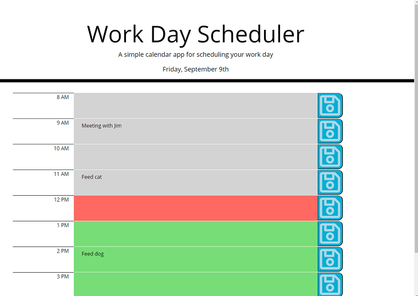

# Day-Scheduler

# This is the submission for Day Scheduler homework [Day Scheduler](https://uwa.bootcampcontent.com/UWA-Bootcamp/uw-blv-virt-fsf-pt-07-2021-u-c/-/tree/master/05-Third-Party-APIs/02-Homework) for U/W Coding Bootcamp Full Stack Flex Program, for Kurt Heimerman.  

## This web app allows a user to schedule their day during working hours.      
* The current date is displayed at the top.
* The UI uses Bootstrap to create a container with one row containing 3 cols (time, description, save).
* It is responsive with miminal effort due to the nature of the layout (mostly columnar).
* A row is created for each working hour of the day, color-coded for past, present and future times.
* Google Fonts API was already included in the starter index.html page.
* Font Awesome was used to create the save icon.
* Clicking 'Save' saves the content into local storage. 

## The deployed app is here:  https://kurtgithubok.github.io/Day-Scheduler/

## Implemented using Bootstrap, JQuery, and MomentJS.

## Challenging parts include getting Bootstrap to remove padding in the description section (I overcame that by prototyping a simpler version to get the Bootstrap attributes correct).

